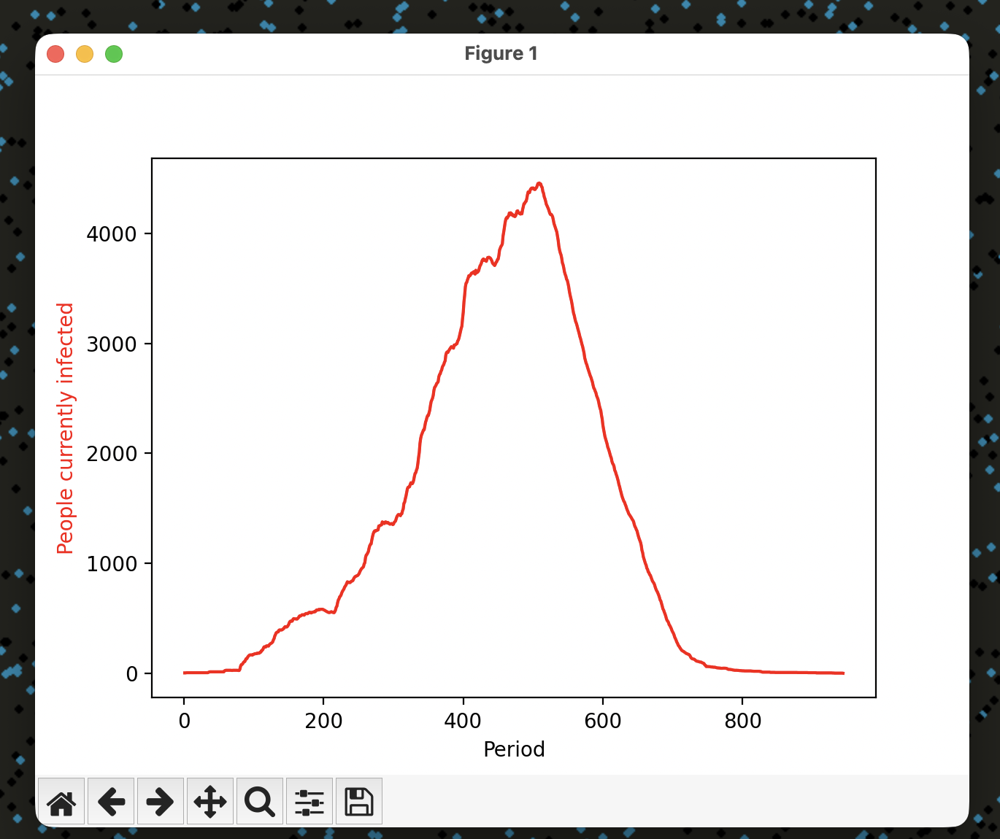

# Pandemic Simulation

This repository was created with the help of a YouTube tutorial by Coding Cassowary.  
Playlist link: https://youtube.com/playlist?list=PLBLV84VG7Md_JGMCHNOqvAvsTPc7zi1xB&si=nF1UBzz2h6kGmF24

## Overview

In this simulation, balls representing people are divided into four categories:

1. **Susceptible** (White)
2. **Infected** (Red)
3. **Recovered and Immune** (Blue)
4. **Dead** (Black)

Using these categories, we can visualize the spread of a disease.

Currently, the simulation parameters can be controlled using the `Pandemic()` class, which includes the following parameters:

1. Number of people
2. Size of the balls representing people
3. Movement speed
4. Infection distance
5. Recovery time
6. Immunity time
7. Probability of infection
8. Probability of death

## Running the Simulation

To run the simulation, first clone this repository and then execute the following commands in your terminal:

```bash
cd "path_to_project_folder"
pip install -r requirements.txt
python3 main.py
```

The simulation automatically ends when number of infected person is 0
and produces a graph documenting the number of infected people throughout the time

Users can

1. Quit the sumilation using the escape key
2. Restart the simulation using return/enterkey
3. Pause the simulation using space key

## Example Usage

Simulation running with healthy,infected,recovered and dead people.


Graph produced at the end of the simulation when no infected person is left.


